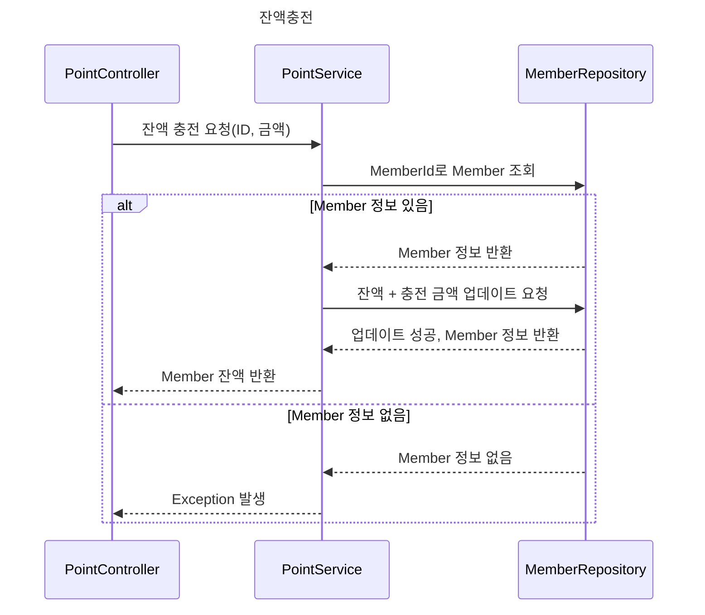

```mermaid
sequenceDiagram
    title 잔액충전
    participant PointController
    participant PointService
    participant MemberRepository

    PointController->>PointService: 잔액 충전 요청(ID, 금액)
    PointService->>MemberRepository: MemberId로 Member 조회
    alt Member 정보 있음
        MemberRepository-->>PointService: Member 정보 반환
        PointService->>MemberRepository: 잔액 + 충전 금액 업데이트 요청
        MemberRepository-->>PointService: 업데이트 성공, Member 정보 반환
        PointService-->>PointController: Member 잔액 반환
    else Member 정보 없음
        MemberRepository-->>PointService: Member 정보 없음
        PointService-->>PointController: Exception 발생
    end
```