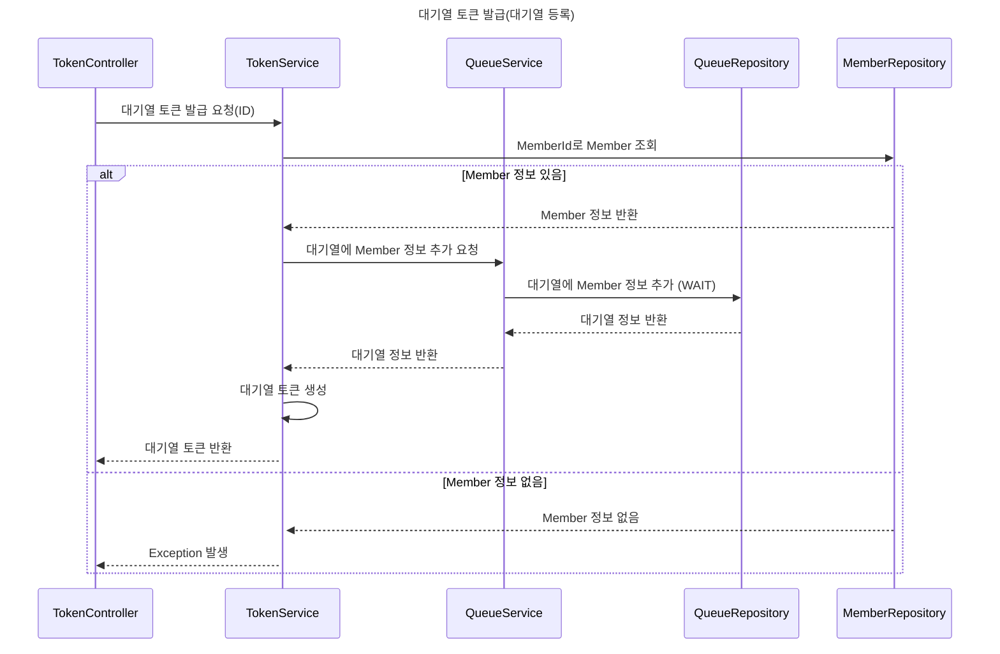

```mermaid
sequenceDiagram
    title 대기열 토큰 발급(대기열 등록)
    participant TokenController
    participant TokenService
    participant QueueService
    participant QueueRepository
    participant MemberRepository

    TokenController->>TokenService: 대기열 토큰 발급 요청(ID)
    TokenService->>MemberRepository: MemberId로 Member 조회
    alt Member 정보 있음
        MemberRepository-->>TokenService: Member 정보 반환
        TokenService->>QueueService: 대기열에 Member 정보 추가 요청
        QueueService->>QueueRepository: 대기열에 Member 정보 추가 (WAIT)
        QueueRepository-->>QueueService: 대기열 정보 반환
        QueueService-->>TokenService: 대기열 정보 반환
        TokenService->>+TokenService: 대기열 토큰 생성
        TokenService-->>TokenController: 대기열 토큰 반환
    else Member 정보 없음
        MemberRepository-->>TokenService: Member 정보 없음
        TokenService-->>TokenController: Exception 발생
    end
```