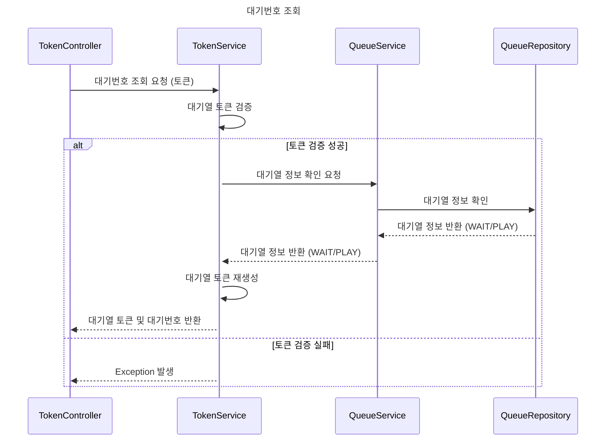

```mermaid
sequenceDiagram
    title 대기번호 조회
    participant TokenController
    participant TokenService
    participant QueueService
    participant QueueRepository

    TokenController->>TokenService: 대기번호 조회 요청 (토큰)
    TokenService->>+TokenService: 대기열 토큰 검증
    alt 토큰 검증 성공
        TokenService->>QueueService: 대기열 정보 확인 요청
        QueueService->>QueueRepository: 대기열 정보 확인
        QueueRepository-->>QueueService: 대기열 정보 반환 (WAIT/PLAY)
        QueueService-->>TokenService: 대기열 정보 반환 (WAIT/PLAY)
        TokenService->>+TokenService: 대기열 토큰 재생성
        TokenService-->>TokenController: 대기열 토큰 및 대기번호 반환
    else 토큰 검증 실패
        TokenService-->>TokenController: Exception 발생
    end
```