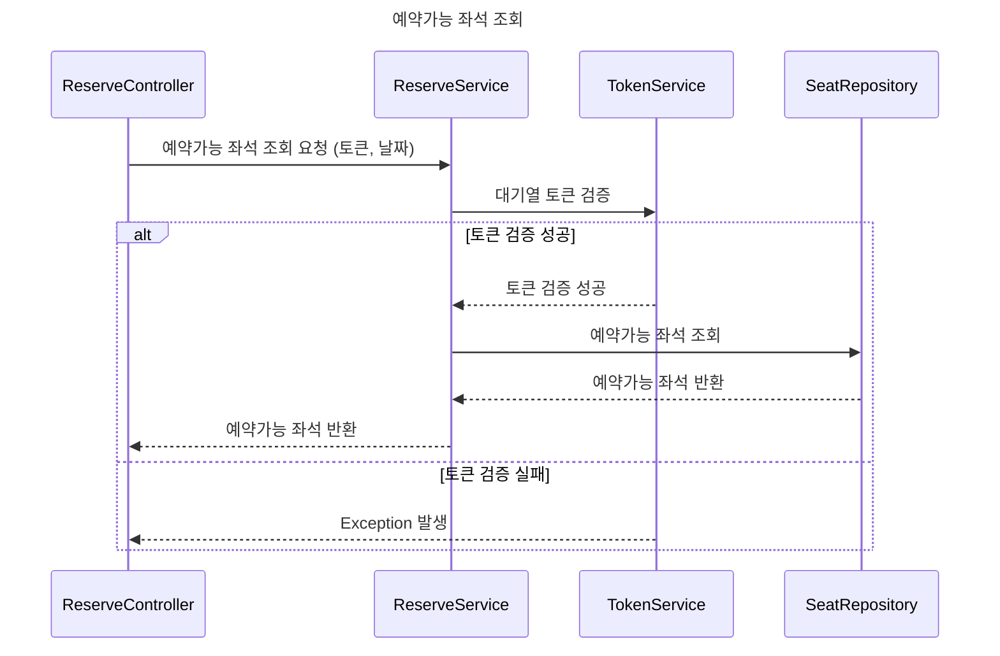

```mermaid
sequenceDiagram
    title 예약가능 좌석 조회
    participant ReserveController
    participant ReserveService
    participant TokenService
    participant SeatRepository

    ReserveController->>ReserveService: 예약가능 좌석 조회 요청 (토큰, 날짜)
    ReserveService->>TokenService: 대기열 토큰 검증
    alt 토큰 검증 성공
        TokenService-->>ReserveService: 토큰 검증 성공
        ReserveService->>SeatRepository: 예약가능 좌석 조회
        SeatRepository-->>ReserveService: 예약가능 좌석 반환
        ReserveService-->>ReserveController: 예약가능 좌석 반환
    else 토큰 검증 실패
        TokenService-->>ReserveController: Exception 발생
    end
```