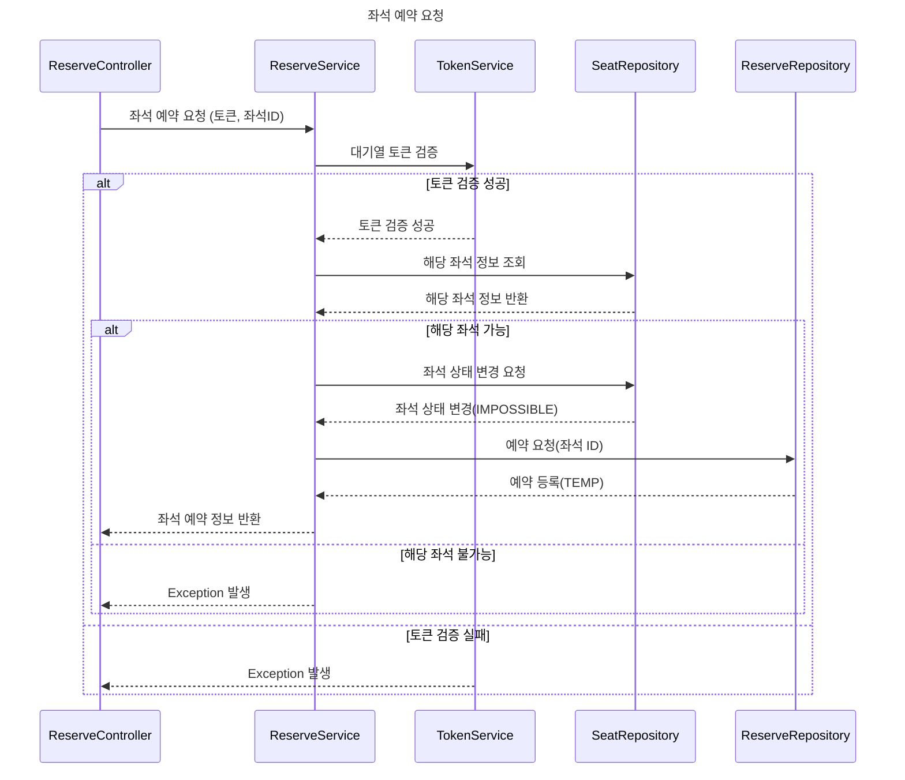

```mermaid
sequenceDiagram
    title 좌석 예약 요청
    participant ReserveController
    participant ReserveService
    participant TokenService
    participant SeatRepository
    participant ReserveRepository

    ReserveController->>ReserveService: 좌석 예약 요청 (토큰, 좌석ID)
    ReserveService->>TokenService: 대기열 토큰 검증
    alt 토큰 검증 성공
        TokenService-->>ReserveService: 토큰 검증 성공
        ReserveService->>SeatRepository: 해당 좌석 정보 조회
        SeatRepository-->>ReserveService: 해당 좌석 정보 반환
        alt 해당 좌석 가능
            ReserveService->>SeatRepository: 좌석 상태 변경 요청
            SeatRepository-->>ReserveService: 좌석 상태 변경(IMPOSSIBLE)
            ReserveService->>ReserveRepository: 예약 요청(좌석 ID)
            ReserveRepository-->>ReserveService: 예약 등록(TEMP)
            ReserveService-->>ReserveController: 좌석 예약 정보 반환
        else 해당 좌석 불가능
            ReserveService-->>ReserveController: Exception 발생
        end
    else 토큰 검증 실패
        TokenService-->>ReserveController: Exception 발생
    end
```