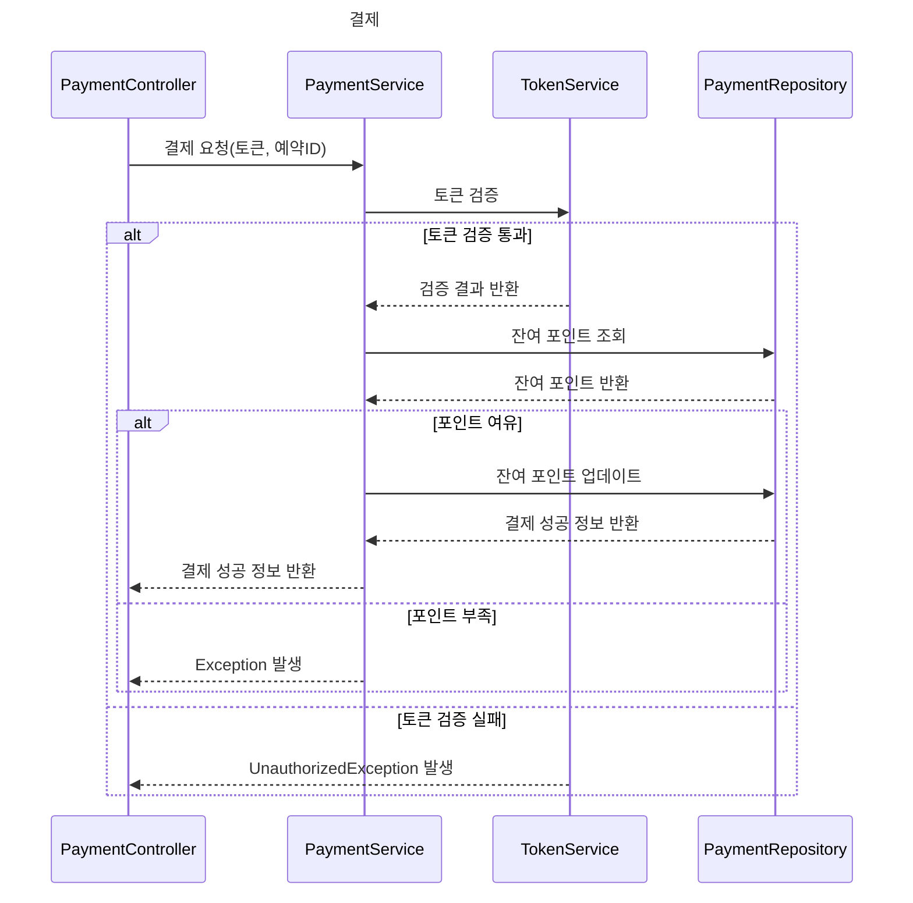

```mermaid
sequenceDiagram
    title 결제
    participant PaymentController
    participant PaymentService
    participant TokenService
    participant PaymentRepository

    PaymentController->>PaymentService: 결제 요청(토큰, 예약ID)
    PaymentService->>TokenService: 토큰 검증
    alt 토큰 검증 통과
        TokenService-->>PaymentService: 검증 결과 반환
        PaymentService->>PaymentRepository: 잔여 포인트 조회
        PaymentRepository-->>PaymentService: 잔여 포인트 반환
        alt 포인트 여유
            PaymentService->>PaymentRepository: 잔여 포인트 업데이트
            PaymentRepository-->>PaymentService: 결제 성공 정보 반환
            PaymentService-->>PaymentController: 결제 성공 정보 반환
        else 포인트 부족
            PaymentService-->>PaymentController: Exception 발생
        end
    else 토큰 검증 실패
        TokenService-->>PaymentController: UnauthorizedException 발생
    end
```